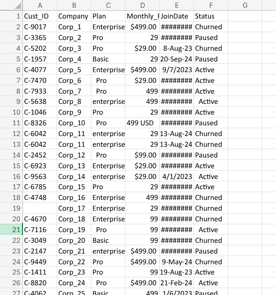
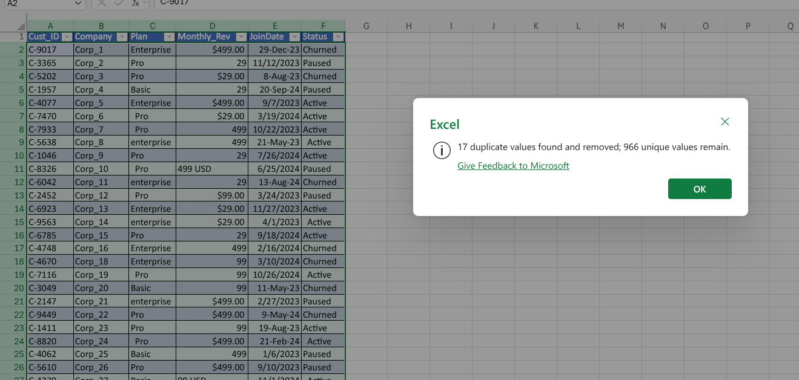
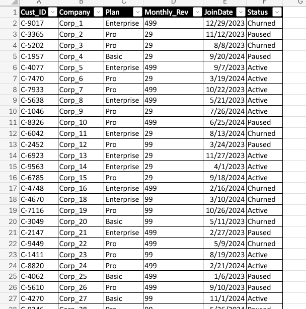

# SaaS Churn Data Cleaning

**Project:** Cleaning a highly unstructured SaaS Churn dataset to prepare it for Pivot Table analysis.
**Tool:** Excel for the Web
**Techniques:** Data Formatting, String Trimming, Date Standardization, Deduplication.

## The Sabotage (Traps Handled)
This raw dataset was corrupted with the following data engineering issues:
1. **Ghost Columns:** Blank columns extending past the structured data boundary.
2. **Invisible Spaces:** Leading and trailing spaces in the `Plan` and `Status` columns.
3. **Currency text strings:** `Monthly_Rev` trapped as text (e.g., `$499.00` and `99 USD`).
4. **Mixed Date Formats:** Combinations of `YYYY/MM/DD` and `DD-Mon-YYYY`.
5. **Null Primary Keys:** Missing `Cust_ID` values (dead rows).
6. **Hidden Duplicates:** Identical transactional rows buried in the dataset.

## 1. The Raw Data (Before)

## 2. Duplicate Removal
*Identified and deleted duplicate transactional rows.*

## 3. The Cleaned Data (After)
*Null Primary Keys deleted. Dates recognized as serials. Revenue converted to pure integers. Strings TRIMmed. Ready for Dashboards.*

