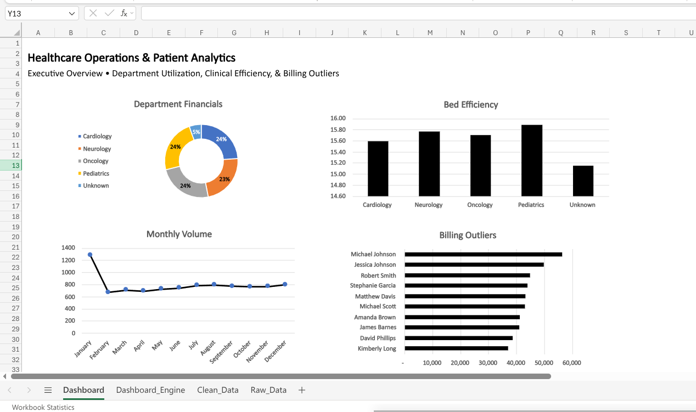

# 🏥 Healthcare Operations Analytics

## 📝 Business Scenario
The Chief Medical Officer required an analysis of hospital efficiency and cost drivers, but the raw data export from IT was riddled with missing records and formatting errors. The goal was to clean the patient data, analyze cost drivers, and build an interactive dashboard for the upcoming board meeting.

## 🏗️ Architecture & Workflow
This practice uses a layered architecture to separate raw data from the final visual dashboard:
* **Data Engineering (Excel):** Cleaned invisible spaces (`TRIM`), handled missing values/blanks using Logic Gates (`IF`, `ISBLANK`), and consolidated fragmented patient records.
* **Data Modeling:** Extracted chronological data (Months) from raw timestamps to build admission funnels.
* **Dashboard Engine & UI:** Built dynamic Pivot Tables and basic interactive, presentation-ready Dashboard.

## 🔍 Key Findings
* **Department Financials:** Cardiology, Neurology, Oncology, and Pediatrics drive the core financial volume. Patient costs scale evenly across departments after successfully filtering out "Unknown" buckets.
* **Admission Funnels:** Patient intake exhibits a stable chronological baseline throughout most of the year, followed by a sharp volume surge arriving toward the final months.
* **Bed Efficiency:** The average length of stay remains remarkably consistent across all clinical departments (hovering tightly between 15 and 16 days).
* **Billing Outliers:** High-cost anomalies are driven by specific acute individual cases (e.g., peak at $56,390) rather than sweeping departmental inflation.

## 💡 Strategic Recommendations
1. **Implement Upfront Data Capture Validation:** Mandate required fields for patient names at initial intake to eliminate the multi-million dollar "Unknown" data aggregation bucket at the data entry layer.
2. **Investigate Year-End Volume Spikes:** Allocate nursing and administrative staff proactively ahead of the final-quarter admission surge to prevent physician burnout.
3. **Audit Long-Stay Patient Protocols:** Review clinical pathways for treatments exceeding the 15-day length-of-stay average to identify bottlenecks in discharge planning.
4. **Monitor Acute-Care Cost Drivers:** Establish a specialized financial review tier for single-patient treatments crossing the $50,000 threshold to optimize insurance reimbursement.

## 📊 Dashboard Preview

